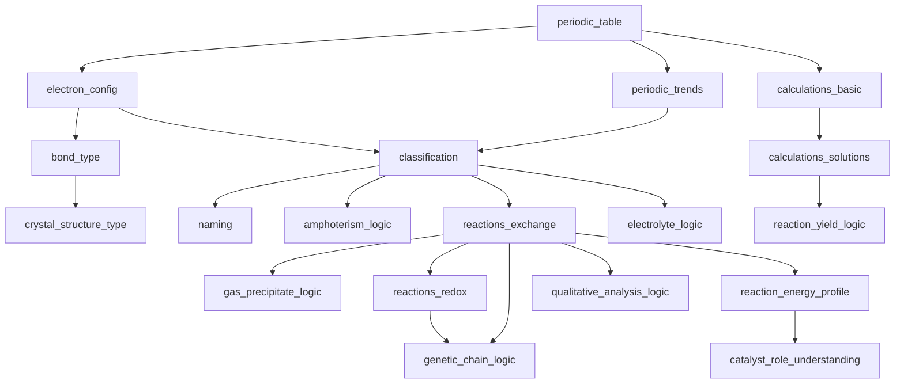

# 📊 Финальная карта компетенций и зависимостей (ОГЭ)
## Проект: «Химия без магии»
Версия: 2026-02-15

Этот документ объединяет:
- исходную карту компетенций
- новые узлы, выявленные при анализе формата ОГЭ
- граф зависимостей (пререквизиты)
- логические блоки курса

---

# 1. Полный список компетенций

## Блок A — Строение атома и ПСХЭ
- periodic_table
- electron_config
- periodic_trends

## Блок B — Химическая связь и строение вещества
- bond_type
- crystal_structure_type

## Блок C — Классы веществ и номенклатура
- classification
- naming
- amphoterism_logic

## Блок D — Реакции
- reactions_exchange
- gas_precipitate_logic
- reactions_redox
- genetic_chain_logic
- qualitative_analysis_logic

## Блок E — Энергетика
- reaction_energy_profile
- catalyst_role_understanding

## Блок F — Расчёты
- calculations_basic
- calculations_solutions
- reaction_yield_logic

## Блок G — Растворы и электролиты
- electrolyte_logic

---

# 2. Граф зависимостей (Mermaid)

---

# 3. Критические узлы (bottlenecks)

Наиболее влияющие компетенции:

1. periodic_table  
2. classification  
3. reactions_exchange  
4. calculations_basic  

Их провал блокирует несколько веток одновременно.

---

# 4. Минимальный диагностический набор

Для покрытия всех узлов требуется задания на:

- periodic_table
- periodic_trends
- bond_type
- crystal_structure_type
- classification
- reactions_exchange
- reactions_redox
- genetic_chain_logic
- electrolyte_logic
- calculations_basic
- calculations_solutions
- reaction_yield_logic

---

# 5. Связь с BKT

Каждая компетенция имеет:
- P(L0)
- P(T)
- P(S)
- P(G)

Зависимости используются на уровне policy (см. 07_adaptive_bkt_math_model.md).
