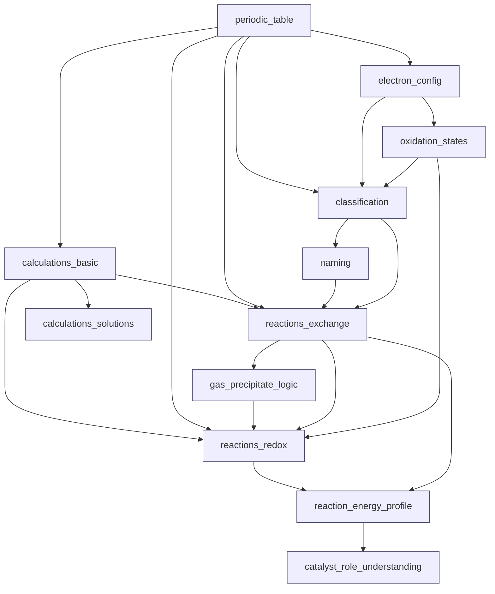

# 🗺️ Граф зависимостей компетенций (Mermaid)
## Проект: «Химия без магии»
Версия: 2026-02-15

> Этот документ предназначен для хранения рядом с:
> - `01_learning_plan.md`
> - `02_technical_spec.md`
> - `03_competency_map.md`

---

# 1. Граф зависимостей

---

# 2. Интерпретация

- **periodic_table** — базовый слой, влияет на всё (металл/неметалл, валентные электроны, тренды).
- **electron_config** — ключ к связям/валентности и пониманию закономерностей.
- **oxidation_states** — мост к ОВР и корректной интерпретации реакций.
- **classification + naming** — делает возможными быстрые «школьные» операции (распознать класс и предсказать типовую реакцию).
- **gas_precipitate_logic** — объясняет, почему обмен идёт/не идёт.
- **reaction_energy_profile + catalyst_role_understanding** — обязательны для «без магии» (условия и скорость реакции).

---

# 3. Использование в продукте

- Диагностика: составление минимального набора заданий, покрывающих вершины графа.
- Ремедиация: если провал на узле, добираем prerequisites по входящим рёбрам.
- UI: отображение прогресса с «узкими горлышками» (bottlenecks) по пути.
