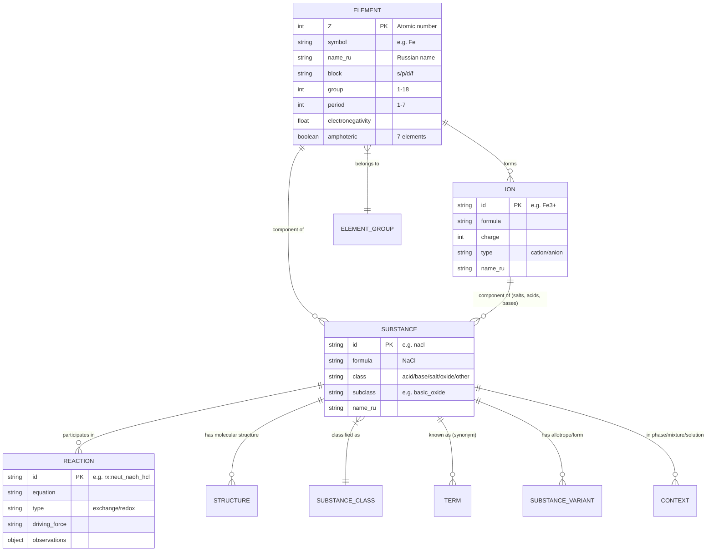

# Ontology Map — Chemistry Without Magic

> Comprehensive reference of all data layers, their relationships, and integration points.
> Last updated: 2026-02-27

---

## 1. Overview & Entity Count Table

| Layer | Source Location | Key Files | Entity Count | Status |
|-------|----------------|-----------|-------------|--------|
| **Elements** | `data-src/elements.json` | 1 | 118 | Active |
| **Ions** | `data-src/ions.json` | 1 | 41 | Active |
| **Substances** | `data-src/substances/*.json` | 80 | 80 | Active |
| **Reactions** | `data-src/reactions/reactions.json` | 1 | 32 (26 exchange + 6 redox) | Active |
| **Competencies** | `data-src/rules/competencies.json` | 1 | 21 (20 + schema) | Active |
| **Classification Rules** | `data-src/rules/classification_rules.json` | 1 | 12 | Active |
| **Naming Rules** | `data-src/rules/naming_rules.json` | 1 | 37 | Active |
| **Solubility Rules** | `data-src/rules/solubility_rules_*.json` | 2 | 7 full / 4 light | Active |
| **Activity Series** | `data-src/rules/activity_series.json` | 1 | 18 | Active |
| **Applicability Rules** | `data-src/rules/applicability_rules.json` | 1 | 15 | Active |
| **Bond Theory + Examples** | `data-src/rules/bond_theory.json`, `bond_examples.json` | 2 | 17 examples | Active |
| **Oxidation Theory + Examples** | `data-src/rules/oxidation_theory.json`, `oxidation_examples.json` | 2 | 22 examples | Active |
| **Properties** | `data-src/rules/properties.json` | 1 | 5 | Active |
| **BKT Params** | `data-src/rules/bkt_params.json` | 1 | 21 | Active |
| **Qualitative Tests** | `data-src/rules/qualitative_reactions.json` | 1 | 11 | Active |
| **Genetic Chains** | `data-src/rules/genetic_chains.json` | 1 | 5 | Active |
| **Energy & Catalysis** | `data-src/rules/energy_catalyst_theory.json` | 1 | 5 rate factors + catalysts + equilibrium | Active |
| **Calculations Data** | `data-src/rules/calculations_data.json` | 1 | 24 substances + 10 reactions | Active |
| **Ion Nomenclature** | `data-src/rules/ion_nomenclature.json` | 1 | 4 suffix rules | Active |
| **Topic Mapping** | `data-src/rules/topic_mapping.json` | 1 | 8 mappings | Active |
| **Diagnostic Questions** | `data-src/diagnostic/questions.json` | 1 | 12 | Active |
| **Exam Systems** | `data-src/exam/systems.json` | 1 | 5 systems | Active |
| **Exam Tasks** | `data-src/exam/oge_tasks.json` + per-system | 6+ | 163 total | Active |
| **Solution Algorithms** | `data-src/exam/oge_solution_algorithms.json` + per-system | 6+ | 54 total | Active |
| **Process Vocabulary** | `data-src/process_vocab.json` | 1 | 36 processes | Active |
| **Quantities & Units** | `data-src/quantities_units_ontology.json` | 1 | 16 quantities + 27 units | Active |
| **Contexts** | `data-src/contexts/contexts.json` | 1 | 5 | Active |
| **Substance Variants** | `data-src/contexts/substance_variants.json` | 1 | 5 | Active |
| **Terms** | `data-src/contexts/terms.json` | 1 | 54 | Active |
| **Term Bindings** | `data-src/contexts/term_bindings.json` | 1 | 54 | Active |
| **Engine Task Templates** | `data-src/engine/task_templates.json` | 1 | 65 | Active |
| **Engine Prompt Templates** | `data-src/engine/prompt_templates.{locale}.json` | 4 | 65 per locale | Active |
| **Structures** | `data-src/structures/*.json` | 38 | 38 molecules | Active |
| **Element Groups** | `data-src/element-groups.json` | 1 | 10 | Active |
| **Sources** | `data-src/sources_list.json` | 1 | 4 references | Active |
| **Translation Overlays** | `data-src/translations/{en,pl,es}/*.json` | 32 | 3 locales × 10–11 files | Active |
| **RU Morphology** | `data-src/translations/ru/morphology.json` | 1 | 43 elements + 8 properties | Active |
| **Reaction Roles** | `data-src/reactions/reaction_roles.json` | 1 | 11 roles, 162 participants | Active |
| **Decomposition Drivers** | (proposed) `drivers.v1.json` | — | process + driver + rule | Deferred |
| **Relations Graph** | (proposed) `predicates.v1.json` | — | ~20 predicates | Deferred |

**Totals**: ~217 source JSON files, ~280+ built files, 4 locales, 5 exam systems.

---

## 2. Core Entity Diagram



### ID Namespace Conventions

| Prefix | Domain | Example |
|--------|--------|---------|
| `el:` | Elements | `el:Fe`, `el:Na` |
| `ion:` | Ions | `ion:Fe3+`, `ion:SO4_2-` |
| `sub:` | Substances | `sub:NaCl`, `sub:H2SO4` |
| `rx:` | Reactions | `rx:neut_naoh_hcl` |
| `proc:` | Processes | `proc:decomposition` |
| `ctx:` | Contexts | `ctx:phase_H2O_s` |
| `ctxtmpl:` | Context Templates | `ctxtmpl:H2SO4_conc` |
| `subvar:` | Substance Variants | `subvar:C_diamond` |
| `term:` | Terms | `term:marble` |
| `sk:` | Competencies | `sk:periodic_table` |
| `comp:` | Competencies (alt) | `comp:oxidation_states` |
| `q:` | Quantities | `q:mass`, `q:amount` |
| `unit:` | Units | `unit:g`, `unit:mol` |
| `meas:` | Measurements | `meas:1` |
| `prob:` | Problems | `prob:stoich_zn_hcl_001` |
| `cond:` | Conditions | `cond:heat` |
| `driver:` | Drivers (proposed) | `driver:thermal` |
| `rule:` | Process Rules (proposed) | `rule:passivation.metals` |

---

## 3. Rule System Diagram


### Rule → Entity Governance Matrix

| Rule File | Governs | Purpose |
|-----------|---------|---------|
| `classification_rules` | Substances | Oxide/acid/base/salt class assignment |
| `naming_rules` | Substances | Systematic & trivial name generation |
| `solubility_rules_*` | Ion pairs | Soluble/insoluble/slightly_soluble |
| `activity_series` | Elements (metals) | Displacement feasibility ordering |
| `applicability_rules` | Reactions | 15 conditions: passivation, noble metals, gas formation, amphoterism |
| `bond_examples` | Substances | Bond type: ionic/covalent_polar/covalent_nonpolar/metallic |
| `oxidation_examples` | Elements in compounds | Oxidation state assignment |
| `properties` | Elements | EN, IE, atomic radius, EA, metallic radius |
| `qualitative_reactions` | Substances | Observable indicators: color, gas, precipitate |
| `genetic_chains` | Substances | Multi-step transformation sequences |
| `energy_catalyst_theory` | Reactions | Rate factors, activation energy, equilibrium shifts |
| `calculations_data` | Substances + Reactions | Molar mass, composition, stoichiometric coefficients |
| `ion_nomenclature` | Ions | Suffix system: -id/-ite/-ate |
| `bkt_params` | Competencies | P(L₀), P(T), P(G), P(S) per skill |
| `competencies` | All entities | 20 learning objectives in A–G blocks |

---

## 4. Task Engine Pipeline Diagram


### Generator → Competency Mapping

| Generator | Competency Block | Description |
|-----------|-----------------|-------------|
| `pick_element_pair` | A (Periodic Table) | Compare element properties |
| `pick_elements_same_period` | A | Trend ordering within period |
| `pick_element_position` | A | Identify by group/period |
| `pick_element_for_config` | A (Electron Config) | Write electron configuration |
| `pick_element_for_valence` | A | Determine valence |
| `pick_oxidation_example` | A (Oxidation States) | Assign oxidation states |
| `pick_bond_example` | B (Bonding) | Identify bond type |
| `pick_bond_pair` | B | Compare crystal/melting |
| `pick_substance_by_class` | C (Classification) | Classify substance |
| `pick_ion_pair` | C (Naming) | Compose salt formula |
| `pick_salt_pair` | D (Reactions) | Solubility check |
| `pick_reaction` | D | Exchange/redox reactions |
| `pick_qualitative_test` | D | Identify by observation |
| `pick_genetic_chain` | D | Fill chain gaps |
| `pick_catalyst` | E (Energetics) | Identify catalyst role |
| `pick_equilibrium_shift` | E | Le Chatelier application |
| `pick_solution_params` | F (Calculations) | Solution calculations |
| `pick_calc_substance` | F | Molar mass, mass fraction |
| `pick_calc_reaction` | F | Stoichiometry |
| `pick_ion_nomenclature` | G (Electrolytes) | Name ions by suffix |
| `pick_ion_pair_nomenclature` | G | Ion naming pairs |

### Interaction Types (7)

| Type | UI Component | Used By |
|------|-------------|---------|
| `choice_single` | Radio buttons | Most generators |
| `choice_multi` | Checkboxes | Classification, multi-select |
| `order_dragdrop` | Drag-and-drop list | Trend ordering |
| `numeric_input` | Number field ±tolerance | Calculations |
| `match_pairs` | Two-column matching | Ion nomenclature |
| `interactive_orbital` | Orbital diagram | Electron config |
| `guided_selection` | Gap-fill dropdowns | Genetic chains |

---

## 5. Build Pipeline Diagram


### Caching Strategy

| Path | Cache-Control | TTL |
|------|--------------|-----|
| `/data/latest/manifest.json` | `max-age=300` | 5 min |
| `/data/{hash}/**` | `immutable, max-age=31536000` | 1 year |
| Locale search/name indices | Same as hash bundle | 1 year |

### Adding a New Data File — Checklist

1. Add JSON to `data-src/` in appropriate directory
2. Add schema validation in `scripts/build-data.mjs`
3. Add copy step in build pipeline
4. Add entrypoint key in `src/types/manifest.ts` (`ManifestEntrypoints`)
5. Add loader function in `src/lib/data-loader.ts`
6. If engine-relevant: add to `OntologyData` in `src/lib/task-engine/types.ts`
7. If translatable: add overlays in `data-src/translations/{en,pl,es}/`

---

## 6. Translation Overlay Diagram


### Overlay Mechanics

- **Key matching**: Overlay files are keyed by item `id` field (same as base data)
- **Field merging**: Only translated fields are present in overlay; merged at runtime via `applyOverlay()`
- **Convention**: Base data uses `_ru` suffix for Russian fields (`name_ru`, `description_ru`)
- **Locale detection**: `PARAGLIDE_LOCALE` cookie → `Astro.currentLocale` → passed to loaders

### Translation Coverage

| Data Key | en | pl | es |
|----------|:--:|:--:|:--:|
| `elements` | ✓ | ✓ | ✓ |
| `ions` | ✓ | ✓ | ✓ |
| `substances` | ✓ | ✓ | ✓ |
| `competencies` | ✓ | ✓ | ✓ |
| `reactions` | ✓ | ✓ | ✓ |
| `pages` | ✓ | ✓ | ✓ |
| `element_groups` | ✓ | ✓ | ✓ |
| `bond_theory` | ✓ | ✓ | ✓ |
| `process_vocab` | ✓ | ✓ | ✓ |
| `terms` | ✓ | ✓ | ✓ |
| `diagnostic_questions` | ✓ | — | — |
| **Prompt templates** | ✓ (65) | ✓ (65) | ✓ (65) |
| **RU Morphology** | — | — | — |

---

## 7. Context Layer Diagram

```mermaid
graph TB
    subgraph Contexts["Context Types"]
        PH["Phase Form<br/>ctx:phase_H2O_s (ice)<br/>ctx:phase_CO2_s (dry ice)"]
        MX["Mixture<br/>ctx:mix_aqua_regia<br/>(3 HCl + 1 HNO₃)"]
        ST["Solution Template<br/>ctxtmpl:H2SO4_conc<br/>(90-98% mass fraction)"]
        ML["Melt<br/>ctx:melt_NaCl<br/>(electrolysis context)"]
    end

    subgraph Variants["Substance Variants"]
        CD["subvar:C_diamond"]
        CG["subvar:C_graphite"]
        CC["subvar:C_coal"]
        PW["subvar:P_white"]
        PR["subvar:P_red"]
    end

    subgraph Terms["Terms (54 synonyms)"]
        T1["term:ice → ctx:phase_H2O_s"]
        T2["term:marble → sub:caco3"]
        T3["term:rust → sub:fe2o3"]
        T4["term:salt → sub:nacl"]
        T5["term:aqua_regia → ctx:mix_aqua_regia"]
        T6["term:conc_sulfuric_acid → ctxtmpl:H2SO4_conc"]
    end

    subgraph Bindings["Term Bindings (54 entries)"]
        TB1["term_id → target ref<br/>(substance / context / variant)"]
    end

    subgraph ReverseIdx["Reverse Index (built)"]
        RI["ref.id → term_id[]<br/>e.g. sub:nacl → [term:salt]"]
    end

    Terms --> Bindings
    Bindings --> Contexts
    Bindings --> Variants
    Bindings -->|"direct substance ref"| SUB["Substances"]
    Bindings --> ReverseIdx

    style Contexts fill:#e3f2fd,stroke:#2196f3
    style Variants fill:#f3e5f5,stroke:#9c27b0
    style Terms fill:#fff3e0,stroke:#ff9800
```



### Context Spec Patterns

| Type | Spec Shape | Example |
|------|-----------|---------|
| `phase_form` | `{ ref: {kind, id}, phase: "s\|l\|g\|aq" }` | Ice = H₂O(s) |
| `mixture` | `{ components: [{ref, phase, ratio}...] }` | Aqua regia = 3HCl(aq)+1HNO₃(aq) |
| `solution_template` | `{ solute, solvent, concentration: {type, range} }` | Conc. H₂SO₄ = 90-98% |
| `melt` | `{ ref: {kind, id} }` | Molten NaCl |

---

## 8. Exam System Diagram

```mermaid
graph TB
    subgraph Systems["5 Exam Systems"]
        OGE["OGE<br/>🇷🇺 Russia Grade 9<br/>24 tasks, 180 min<br/>78 task bank"]
        EGE["EGE<br/>🇷🇺 Russia Grade 11<br/>34 tasks, 210 min<br/>27 task bank"]
        GCSE["GCSE<br/>🇬🇧 UK Grades 10-11<br/>30 tasks, 105 min<br/>20 task bank"]
        MATURA["Matura<br/>🇵🇱 Poland Grade 12<br/>45 tasks, 180 min<br/>20 task bank"]
        EBAU["EBAU<br/>🇪🇸 Spain Grade 12<br/>6 tasks, 90 min<br/>18 task bank"]
    end

    subgraph Competencies["20 Competencies (A-G Blocks)"]
        direction LR
        A["Block A<br/>Atomic Structure<br/>periodic_table<br/>electron_config<br/>periodic_trends<br/>oxidation_states"]
        B["Block B<br/>Chemical Bonding<br/>bond_type<br/>crystal_structure_type"]
        C["Block C<br/>Classes & Naming<br/>classification<br/>naming<br/>amphoterism_logic"]
        D["Block D<br/>Reactions<br/>reactions_exchange<br/>gas_precipitate_logic<br/>reactions_redox<br/>genetic_chain_logic<br/>qualitative_analysis_logic<br/>reaction_energy_profile"]
        E["Block E<br/>Energetics<br/>catalyst_role_understanding"]
        F["Block F<br/>Calculations<br/>calculations_basic<br/>calculations_solutions<br/>reaction_yield_logic"]
        G["Block G<br/>Electrolytes<br/>electrolyte_logic<br/>ion_nomenclature"]
    end

    subgraph Mapping["Topic Mapping"]
        TM["topic_mapping.json<br/>exam task → competency"]
    end

    subgraph BKT["Adaptive Learning"]
        BKTE["BKT Engine<br/>P(L), P(T), P(G), P(S)"]
        STOR["localStorage<br/>P(L) per competency"]
        IDB["IndexedDB<br/>attempt history"]
    end

    Systems -->|"task_types[]"| Mapping
    Mapping --> Competencies
    Competencies --> BKT
    BKTE --> STOR
    BKTE --> IDB

    style Systems fill:#e8eaf6,stroke:#3f51b5
    style Competencies fill:#fff8e1,stroke:#ffc107
    style BKT fill:#fce4ec,stroke:#e91e63
```



### Competency Prerequisite Graph


---

## 9. Process Rules

```mermaid
graph TB
    subgraph ProcessVocab["Process Vocabulary (36 types)"]
        direction LR
        CHEM["Chemical Processes<br/>chemical_reaction<br/>neutralization<br/>displacement"]
        OPS["Operations (11)<br/>heating, cooling, stirring,<br/>grinding, dilution, evaporation,<br/>filtration, washing, drying,<br/>decantation, distillation"]
        PHYS["State Changes (6)<br/>dissolution, crystallization,<br/>sublimation, condensation,<br/>melting, boiling"]
        PCHEM["Physicochemical (11)<br/>dissociation, precipitation,<br/>gas_evolution, complexation,<br/>catalysis, electrolysis,<br/>adsorption, photodecomposition"]
        CONST["Constraints (4)<br/>remove_gas, remove_solid,<br/>closed_system, excess_condition"]
    end

    subgraph Applicability["Applicability Rules (15 conditions)"]
        PASS["Passivation<br/>Fe, Al, Cr + cold conc.<br/>H₂SO₄ or HNO₃"]
        NOBLE["Noble Metal<br/>Cu, Hg, Ag, Pt, Au<br/>no H₂ from acids"]
        AMPH["Amphoterism<br/>Al₂O₃, ZnO, BeO<br/>react with acids AND bases"]
        GAS["Gas Formation<br/>carbonate/sulfite/sulfide<br/>+ acid → gas"]
        CONC["Concentrated Acids<br/>H₂SO₄(conc) as oxidizer<br/>HNO₃ always oxidizes"]
    end

    subgraph QUnits["Quantities & Units Ontology"]
        Q["16 Quantities<br/>mass, amount, volume,<br/>concentration, temperature,<br/>pressure, energy, molar_mass,<br/>mass_fraction, yield, enthalpy..."]
        U["27 Units<br/>g, kg, mol, L, K, Pa,<br/>atm, kJ, g/mol, %, ..."]
        M["Measurement schema<br/>{quantity, value, unit, of, at}"]
    end

    ProcessVocab --- Applicability
    ProcessVocab --- QUnits

    style ProcessVocab fill:#e8f5e9,stroke:#4caf50
    style Applicability fill:#fff3e0,stroke:#ff9800
    style QUnits fill:#e3f2fd,stroke:#2196f3
```



### Decomposition Drivers Layer (Designed, Deferred)

The decomposition drivers layer introduces a structured hierarchy for decomposition reactions:

```
proc:decomposition (process)
├── driver:thermal → heating decomposes
├── driver:electro → electric current decomposes
├── driver:photo  → light decomposes
└── driver:chemical → reagent decomposes

Each (process + driver) → rule_base with:
  - applicability (what substances)
  - product pattern (what forms)
  - examples (concrete reactions)
```

**Why deferred**: Requires formula/ion module for product derivation (e.g., `M(OH)n → MxOy + H₂O`). Current applicability rules handle the OGE-relevant subset (passivation, noble metals) without this layer.

---

## 10. Reaction Participant Roles


### Design Principles

1. **Roles are contextual** — a substance is a catalyst only in a specific reaction, not globally
2. **N-ary relations** — each participation record links (reaction, entity, role)
3. **Build-time derivation** — inverse lookup indices generated during build, not stored in source
4. **Educational tasks** enabled: "identify catalyst", "what is the oxidizing agent?", "which substances don't participate?"

### Planned Data Shape

```json
// reaction_roles.json — 11 role definitions
[
  { "id": "reactant", "description": "Substance consumed in reaction" },
  { "id": "product", "description": "Substance formed in reaction" },
  { "id": "catalyst", "description": "Accelerates reaction, not consumed" },
  ...
]

// reaction_participants.json — derived from existing reactions
[
  {
    "reaction": "rx:ostwald_step1",
    "entity": "sub:Pt",
    "role": "catalyst"
  },
  {
    "reaction": "rx:ostwald_step1",
    "entity": "sub:NH3",
    "role": "reactant",
    "stoichiometry": 4
  }
]
```

---

## 11. Proposed Layers (Not Yet Integrated)

### Relations Graph (`predicates.v1.json`)

**Purpose**: Typed semantic triples — `subject → predicate → object` with conditions. Enables universal queries like "what allotropes does carbon have?" or "why doesn't aluminum react with water?".

**Core predicates** (~20):
- Taxonomy: `is_instance_of`, `is_subclass_of`, `member_of_group`
- Composition: `has_component`, `has_allotrope`
- Properties: `has_property`, `has_numeric_property`
- Processes: `participates_in_process`, `has_surface_layer`, `blocks_reaction_family`
- Context: `phase_of`, `solution_of`, `mixture_of`, `melt_of`

**Design principle**: Store forward edges only; derive inverse edges at build time (`member_of_group` → `has_member`).

**Why deferred**: The current system handles all OGE/EGE tasks without a generic graph layer. Relations would add value for (a) advanced cross-domain queries, (b) more sophisticated distractor generation, and (c) explanatory reasoning chains. Worth revisiting when the task engine needs cross-entity reasoning beyond what applicability rules provide.

### Decomposition Drivers (`drivers.v1.json`)

**Purpose**: Hierarchical model for decomposition reactions: `process × driver → rule_base → products`.

**Structure**:
- 1 process (`proc:decomposition`)
- 4 drivers (`thermal`, `electro`, `photo`, `chemical`)
- 3 example rule bases (insoluble base decomposition, KClO₃ decomposition, water electrolysis)
- Per-rule: applicability conditions, product patterns, concrete examples

**Why deferred**: Product derivation requires formula manipulation (e.g., `Cu(OH)₂ → CuO + H₂O`), which the current codebase doesn't have as a general module. The existing `applicability_rules.json` covers the exam-relevant subset (passivation, heat decomposition). Worth integrating alongside formula parsing/balancing.

### Generative Task Engine Starter Pack (`v1`)

**Purpose**: Initial seed templates for the generative task engine.

**Status**: Superseded by the current engine (65 templates, 21 generators, 18 solvers vs. the v1 pack's ~5 templates). Kept as historical reference only.

---

## 12. ID System Reference

### Namespace Registry

| Prefix | Scope | Uniqueness | Example | Assigned In |
|--------|-------|------------|---------|------------|
| (none) | Elements | By `Z` (atomic number) | Z=26 (Fe) | `elements.json` |
| (none) | Ions | By formula string | `Fe3+`, `SO4_2-` | `ions.json` |
| (none) | Substances | By slug | `nacl`, `h2so4` | `substances/*.json` |
| `rx:` | Reactions | By equation hash | `rx:neut_naoh_hcl` | `reactions.json` |
| `ctx:` | Contexts | By canonical key | `ctx:phase_H2O_s` | `contexts.json` |
| `ctxtmpl:` | Context Templates | By spec | `ctxtmpl:H2SO4_conc` | `contexts.json` |
| `subvar:` | Substance Variants | By form | `subvar:C_diamond` | `substance_variants.json` |
| `term:` | Terms | By name | `term:marble` | `terms.json` |
| `sk:` / `comp:` | Competencies | By slug | `periodic_table` | `competencies.json` |
| `q:` | Quantities | By dimension | `q:mass` | `quantities_units_ontology.json` |
| `unit:` | Units | By symbol | `unit:g` | `quantities_units_ontology.json` |
| `meas:` | Measurements | Per-problem | `meas:1` | Problem instances |
| `prob:` | Problems | By content | `prob:stoich_zn_hcl_001` | Problem instances |
| `proc:` | Processes | By type | `proc:decomposition` | `process_vocab.json` |
| `cond:` | Conditions (proposed) | By driver | `cond:heat` | Decomposition layer |
| `driver:` | Drivers (proposed) | By mechanism | `driver:thermal` | Decomposition layer |

### Cross-Reference Patterns

- Competency `oge_task_types[]` → OGE task numbers
- Competency `prerequisites[]` → other competency IDs (DAG)
- Reaction `molecular.reactants/products[].formula` → substance formulas
- Solubility rules `cation`/`anion` → ion formula strings
- Term bindings `ref.id` → substance/context/variant IDs
- Engine template `competency_map` → competency IDs
- Engine template `exam_tags[]` → exam system IDs

---

## 13. Data File Inventory

### Root Level (`data-src/`)

| File | Entries | Purpose |
|------|---------|---------|
| `elements.json` | 118 | All chemical elements |
| `ions.json` | 41 | Chemical ions |
| `element-groups.json` | 10 | Element group metadata |
| `periodic-table-content.json` | 3 | Periodic table layout |
| `process_vocab.json` | 36 | Chemistry process types |
| `quantities_units_ontology.json` | 16q + 27u | Physical quantities and units |
| `reactions_bundle.v1.json` | 6 | Reaction bundle (legacy v1 schema) |
| `sources_list.json` | 4 | Reference source links |

### Reactions (`data-src/reactions/`)

| File | Entries | Purpose |
|------|---------|---------|
| `reactions.json` | 32 | 26 exchange + 6 redox reactions |

### Rules (`data-src/rules/`)

| File | Entries | Purpose |
|------|---------|---------|
| `activity_series.json` | 18 | Metal reactivity order |
| `applicability_rules.json` | 15 | Reaction feasibility conditions |
| `bkt_params.json` | 21 | BKT learning parameters |
| `bond_examples.json` | 17 | Bond type examples |
| `bond_theory.json` | — | Bond theory content |
| `calculations_data.json` | 24+10 | Calc substances + reactions |
| `classification_rules.json` | 12 | Substance classification |
| `competencies.json` | 21 | 20 competencies + schema |
| `energy_catalyst_theory.json` | — | Rate/equilibrium/catalysis |
| `genetic_chains.json` | 5 | Transformation chains |
| `ion_nomenclature.json` | 4 | Ion suffix rules |
| `naming_rules.json` | 37 | Nomenclature rules |
| `oxidation_examples.json` | 22 | Oxidation state examples |
| `oxidation_theory.json` | — | Oxidation theory content |
| `periodic-table-theory.json` | — | Periodic table theory |
| `properties.json` | 5 | Element property definitions |
| `qualitative_reactions.json` | 11 | Characteristic test reactions |
| `solubility_rules_full.json` | 7 | Full solubility rules |
| `solubility_rules_light.json` | 4 | Simplified solubility rules |
| `topic_mapping.json` | 8 | Topic→competency mapping |

### Templates (`data-src/templates/`)

| File | Entries | Purpose |
|------|---------|---------|
| `reaction_templates.json` | 10 | Reaction exercise templates |
| `task_templates.json` | 20 | Generic task templates (legacy) |

### Engine (`data-src/engine/`)

| File | Entries | Purpose |
|------|---------|---------|
| `task_templates.json` | 65 | Generative task definitions |
| `prompt_templates.ru.json` | 65 | Russian prompt strings |
| `prompt_templates.en.json` | 65 | English prompt strings |
| `prompt_templates.pl.json` | 65 | Polish prompt strings |
| `prompt_templates.es.json` | 65 | Spanish prompt strings |

### Contexts (`data-src/contexts/`)

| File | Entries | Purpose |
|------|---------|---------|
| `contexts.json` | 5 | Phase forms, mixtures, solutions, melts |
| `substance_variants.json` | 5 | Allotropes (C: diamond/graphite/coal, P: white/red) |
| `terms.json` | 54 | Named synonyms (ice, marble, rust...) |
| `term_bindings.json` | 54 | Term→entity mappings |

### Exam (`data-src/exam/`)

| File | Entries | Purpose |
|------|---------|---------|
| `systems.json` | 5 | Exam system definitions |
| `oge_tasks.json` | 78 | OGE task bank (legacy) |
| `oge_solution_algorithms.json` | 19 | OGE solution algorithms (legacy) |
| `oge/meta.json` | 1 | OGE system metadata |
| `oge/tasks.json` | 78 | OGE tasks (canonical) |
| `oge/algorithms.json` | 19 | OGE algorithms (canonical) |
| `ege/meta.json` | 1 | EGE system metadata |
| `ege/tasks.json` | 27 | EGE tasks |
| `ege/algorithms.json` | 10 | EGE algorithms |
| `gcse/meta.json` | 1 | GCSE system metadata |
| `gcse/tasks.json` | 20 | GCSE tasks |
| `gcse/algorithms.json` | 10 | GCSE algorithms |
| `egzamin/meta.json` | 1 | Matura system metadata |
| `egzamin/tasks.json` | 20 | Matura tasks |
| `egzamin/algorithms.json` | 8 | Matura algorithms |
| `ebau/meta.json` | 1 | EBAU system metadata |
| `ebau/tasks.json` | 18 | EBAU tasks |
| `ebau/algorithms.json` | 7 | EBAU algorithms |

### Other

| Directory | Files | Purpose |
|-----------|-------|---------|
| `substances/` | 80 | Individual substance JSON files |
| `structures/` | 38 | Molecular structure definitions |
| `diagnostic/` | 1 | 12 initial diagnostic questions |
| `exercises/` | 3 | Legacy exercise sets (bonds, oxidation, periodic table) |
| `dictionaries/` | 7 | Search synonyms, taxonomy, exam profiles |
| `translations/en/` | 11 | English overlays |
| `translations/pl/` | 10 | Polish overlays |
| `translations/es/` | 10 | Spanish overlays |
| `translations/ru/` | 1 | Russian morphology seed |

### Build-Time Generated Files

| Output | Entries | Purpose |
|--------|---------|---------|
| `indices/substance_index.json` | 80 | Master substance search index |
| `indices/by_class/*.json` | 5 files | Substances grouped by class |
| `indices/by_ion/*.json` | 24 files | Substances containing each ion |
| `indices/by_competency/*.json` | 12 files | Exercises by competency |
| `formula_lookup.json` | 239 | Formula→entity mappings |
| `search_index.json` | 306 | Russian search index |
| `search_index.{locale}.json` | 306/locale | Per-locale search indices |
| `name_index.{locale}.json` | ~298/locale | Per-locale name→entity lookup |
| `contexts/reverse_index.json` | — | ref.id→[term_ids] reverse lookup |

---

## 14. Algorithm Location Map

Where each chemistry algorithm is implemented. **Canonical** = single source of truth; others must delegate to it.

### Core Algorithms (src/lib/)

| Algorithm | Canonical Module | Exported Functions | Used By |
|-----------|-----------------|-------------------|---------|
| Electron configuration (Aufbau + exceptions) | `src/lib/electron-config.ts` | `getElectronConfig(Z)`, `getElectronFormula(Z)`, `getShorthandFormula(Z)`, `getValenceElectrons(Z)`, `isException(Z)`, `getOrbitalBoxes(Z)`, `toSuperscript(n)` | Engine solver `electron_config`, legacy `periodic-table/generate-exercises.ts` |
| Bond type classification (Δχ) | `src/lib/bond-calculator.ts` | `determineBondType(elA, elB)`, `determineCrystalStructure(bondType, formula, symbols)`, `analyzeFormula(formula, elementMap)` | Engine solver `delta_chi`, legacy `bonds/generate-exercises.ts` |
| Oxidation state assignment | `src/lib/oxidation-state.ts` | `calcOxidationStates(parsed, elementMap, formula)`, `explainOxidationSteps(parsed, elementMap, formula)` | Legacy `oxidation-states/generate-exercises.ts` |
| Chemical formula parsing | `src/lib/formula-parser.ts` | `parseFormula(formula)` | `bond-calculator.ts`, `oxidation-state.ts` |
| BKT adaptive learning | `src/lib/bkt-engine.ts` | `bktUpdate(pL, params, correct, hintUsed)`, `getLevel(pL)` | All practice islands |

### Engine Solvers (src/lib/task-engine/solvers.ts)

| Solver ID | Algorithm | Delegates To | Status |
|-----------|-----------|-------------|--------|
| `solver.electron_config` | Electron config string | `electron-config.ts` → `getElectronConfig()` | Deduplicated |
| `solver.delta_chi` | Bond type from Δχ | `bond-calculator.ts` → `determineBondType()` | Deduplicated |
| `solver.count_valence` | Valence electron count | Inline (group-based lookup) | No canonical lib needed |
| `solver.compare_property` | Property comparison | Inline (field lookup) | Data-driven, no dup |
| `solver.periodic_trend_order` | Sort by property | Inline (field sort) | Data-driven, no dup |
| `solver.oxidation_states` | Oxidation state | Slot passthrough | No computation |
| `solver.compose_salt_formula` | Salt formula from ions | Inline (LCM math) | Unique to engine |
| `solver.solubility_check` | Solubility lookup | Inline (table lookup) | Data-driven, no dup |
| `solver.compare_crystal_melting` | Crystal melting rank | Inline (rank map) | Unique to engine |
| `solver.driving_force` | Reaction driving force | Inline (condition check) | Data-driven, no dup |
| `solver.activity_compare` | Activity series position | Inline (index lookup) | Data-driven, no dup |
| `solver.predict_observation` | Observation text | Slot passthrough | No computation |
| `solver.molar_mass` | M = Σ(Ar × count) | Inline | **Duplicated in legacy calcs** |
| `solver.mass_fraction` | w% = (Ar×n/M)×100 | Inline | **Duplicated in legacy calcs** |
| `solver.amount_calc` | n = m/M or m = n×M | Inline | **Duplicated in legacy calcs** |
| `solver.concentration` | ω, inverse, dilution | Inline | **Duplicated in legacy calcs** |
| `solver.stoichiometry` | Coefficient-ratio calc | Inline | **Duplicated in legacy calcs** |
| `solver.reaction_yield` | Stoich × yield% | Inline | **Duplicated in legacy calcs** |

### Duplication Status Summary

| Algorithm | src/lib/ | Engine Solver | Legacy Generator | Status |
|-----------|:-------:|:------------:|:---------------:|--------|
| Electron config | ✓ canonical | ✓ delegates | ✓ imports canonical | **Deduplicated** |
| Bond Δχ / type | ✓ canonical | ✓ delegates | ✓ calls canonical | **Deduplicated** |
| Crystal structure | ✓ canonical | ✓ rank-based (different approach) | ✗ inline copy (bonds) | **Legacy duplicates** |
| Oxidation states | ✓ canonical | — passthrough | ✓ imports canonical | **Deduplicated** |
| Molar mass | — | ✓ inline | ✗ inline copy (calcs L72) | **Both inline** |
| Stoichiometry | — | ✓ inline | ✗ inline copy (calcs L247) | **Both inline** |
| Valence electrons | ✓ canonical | ✓ inline (simpler) | ✓ imports canonical | **Acceptable** |

---

## 15. Legacy Generator → Engine Coverage

> **Migration status:** Complete. All exercise generation (competency pages, feature practice sections, exam variants) uses the generative task engine. Legacy generator files deleted (~2,685 LOC removed).

Each legacy feature generator file and which engine templates cover its exercises. Used to track WS2 migration progress.

### Coverage Matrix

| Legacy File | LOC | Exercise Types | Engine Templates Covering | Gaps |
|------------|-----|----------------|--------------------------|------|
| `src/features/periodic-table/practice/generate-exercises.ts` | 206 | 6: find_period_group, select_electron_config, count_valence, identify_exception, compare_electronegativity, element_from_config | 5/6: element_position, electron_config, valence_count, electron_config_exception, compare_property | `element_from_config` reverse-lookup not in engine |
| `src/features/bonds/practice/generate-exercises.ts` | 305 | 6: identify_bond_type, identify_crystal_structure, select_substance_by_bond, predict_property_by_structure, compare_melting_points, bond_from_delta_chi | 4/6: bond_type_identify, crystal_type_identify, bond_pair_compare, delta_chi_classify | `predict_property_by_structure`, `select_substance_by_bond` not in engine |
| `src/features/oxidation-states/practice/generate-exercises.ts` | 189 | 3: determine_ox_state, select_compound_by_ox_state, max_min_ox_state | 3/3: oxidation_state_assign, oxidation_state_find, oxidation_state_extremes | **Fully covered** |
| `src/features/substances/practice/generate-exercises.ts` | 347 | 9: classify_by_formula, classify_subclass, identify_class_by_description, formula_to_name, name_to_formula, identify_amphoteric, amphoteric_reaction_partner, amphoteric_elements, naming_rule_template | 6/9: classify_substance, classify_subclass, naming_formula_to_name, naming_name_to_formula, amphoteric_identify, amphoteric_reaction | `identify_class_by_description`, `amphoteric_elements`, `naming_rule_template` gaps |
| `src/features/ions/practice/generate-exercises.ts` | 370 | 5: formulaToName, nameToFormula, suffixByAcid, cationCharge, anionName | 3/5: ion_formula_to_name, ion_name_to_formula, ion_charge_identify | `suffixByAcid`, `anionName` suffix-rule exercises not in engine |
| `src/features/reactions/practice/generate-exercises.ts` | 957 | 19: classify_reaction_type, predict_exchange_products, will_reaction_occur, identify_driving_force, solubility_lookup, predict_observation, identify_oxidizer_reducer, predict_substitution_products, will_metal_react, activity_series_compare, complete_chain_step, choose_reagent_for_step, identify_reagent_for_ion, identify_ion_by_observation, factors_affecting_rate, exo_endo_classify, equilibrium_shift, catalyst_properties, identify_catalyst | 15/19: reaction_classify, exchange_products, driving_force_check, solubility_check, observation_predict, redox_agent_identify, activity_compare, chain_gap_fill, qualitative_reagent, qualitative_observation, rate_factor, exo_endo, equilibrium_shift, catalyst_role, catalyst_identify | 4 gaps: `predict_exchange_products`, `predict_substitution_products`, `will_metal_react`, `choose_reagent_for_step` |
| `src/features/calculations/practice/generate-exercises.ts` | 316 | 9: calcMolarMass, calcMassFraction, calcAmountOfSubstance, calcMassFromMoles, calcSolutionConcentration, calcSoluteMass, calcDilution, calcReactionYield, calcByEquation | 6/9: molar_mass, mass_fraction, amount_calc(n), stoichiometry, reaction_yield, concentration(omega) | `calcMassFromMoles` (amount_calc m-mode covers?), `calcSoluteMass` (concentration inverse-mode covers?), `calcDilution` (concentration dilution-mode covers?) — verify parity |

### Summary

- **Total legacy LOC**: ~2690
- **Fully covered**: oxidation-states (189 LOC)
- **Mostly covered** (>75%): periodic-table, bonds, reactions, calculations
- **Partially covered** (<75%): substances (6/9), ions (3/5)
- **Migration priority**: reactions (957 LOC, highest LOC), then substances, then ions

---

## 16. Governance Matrix

Source/derived/regenerable status for all data artifacts, build pipeline stages, change impact cascades, and caching strategy.

### 16A. Source Files (manually edited)

| Artifact | Location | Type | Entries | Validator | Used By (runtime) | Change Impact |
|----------|----------|------|---------|-----------|-------------------|---------------|
| Elements | `data-src/elements.json` | source | 118 | `validate.mjs` | `loadElements()` → engine ontology, periodic table, search, ChemText | → formula_lookup, search_index, name_index, substance_index |
| Ions | `data-src/ions.json` | source | 41 | `validate.mjs` | `loadIons()` → engine ontology, ions page, ChemText | → formula_lookup, search_index, name_index, solubility lookups |
| Substances | `data-src/substances/*.json` | source | 80 | `validate.mjs` | `loadSubstance()` → substance pages | → substance_index, by_class/, by_ion/, formula_lookup, search_index |
| Reactions | `data-src/reactions/reactions.json` | source | 32 | `validate.mjs` | `loadReactions()` → engine ontology, reactions page | → reaction_participants, search_index |
| Reaction roles | `data-src/reactions/reaction_roles.json` | source | 11 | `validate.mjs` | `loadReactionRoles()` → reactions page | → reaction_participants derivation |
| Competencies | `data-src/rules/competencies.json` | source | 21 | `validate.mjs` | `loadCompetencies()` → profile, exam, diagnostics | → by_competency/, search_index |
| Classification rules | `data-src/rules/classification_rules.json` | source | 12 | `validate.mjs` | `loadClassificationRules()` → engine ontology | engine only |
| Naming rules | `data-src/rules/naming_rules.json` | source | 37 | `validate.mjs` | `loadNamingRules()` → engine ontology | engine only |
| Solubility (light) | `data-src/rules/solubility_rules_light.json` | source | 7 | `validate.mjs` | — (build-time validation) | validation only |
| Solubility (full) | `data-src/rules/solubility_rules_full.json` | source | 108 | `validate.mjs` | `loadSolubilityRules()` → engine ontology, solubility table | engine + UI |
| Activity series | `data-src/rules/activity_series.json` | source | 18 | `validate.mjs` | `loadActivitySeries()` → engine ontology | engine only |
| Bond examples | `data-src/rules/bond_examples.json` | source | 17 | `validate.mjs` | `loadBondExamples()` → engine ontology | engine only |
| Oxidation examples | `data-src/rules/oxidation_examples.json` | source | 22 | `validate.mjs` | `loadOxidationExamples()` → engine ontology | engine only |
| Properties | `data-src/rules/properties.json` | source | 5 | `validate.mjs` | `loadProperties()` → engine ontology | engine only |
| Qualitative tests | `data-src/rules/qualitative_reactions.json` | source | 11 | `validate.mjs` | `loadQualitativeTests()` → engine ontology | engine only |
| Genetic chains | `data-src/rules/genetic_chains.json` | source | 5 | `validate.mjs` | `loadGeneticChains()` → engine ontology | engine only |
| Energy/catalyst theory | `data-src/rules/energy_catalyst_theory.json` | source | — | `validate.mjs` | `loadEnergyCatalystTheory()` → engine ontology | engine only |
| Calculations data | `data-src/rules/calculations_data.json` | source | 24+10 | `validate.mjs` | `loadCalculationsData()` → engine ontology | engine only |
| Ion nomenclature | `data-src/rules/ion_nomenclature.json` | source | 4 | `validate.mjs` | `loadIonNomenclature()` → engine ontology | engine only |
| Topic mapping | `data-src/rules/topic_mapping.json` | source | 8 | `validate.mjs` | `loadTopicMapping()` → TopicPractice | exam topic routing |
| BKT params | `data-src/rules/bkt_params.json` | source | 21 | `validate.mjs` + `integrity.mjs` | `loadBktParams()` → BKT engine | adaptive learning P(L) |
| Diagnostic questions | `data-src/diagnostic/questions.json` | source | 12 | `validate.mjs` | `loadDiagnosticQuestions()` → diagnostics page | diagnostics only |
| Exam tasks | `data-src/exam/{system}/*.json` | source | 163 total | `validate.mjs` | `loadOgeTasks()` / `loadExamTasks()` → exam practice | exam practice |
| Solution algorithms | `data-src/exam/{system}/*.json` | source | 54 total | `validate.mjs` | `loadOgeSolutionAlgorithms()` / `loadExamAlgorithms()` | exam hints |
| Exam systems | `data-src/exam/systems.json` | source | 5 | — | `loadExamSystems()` → ExamPage | exam system selector |
| Engine task templates | `data-src/engine/task_templates.json` | source | 65 | `validateEngineTaskTemplates()` | `loadTaskTemplates()` → template registry | all practice exercises |
| Engine prompt templates | `data-src/engine/prompt_templates.{locale}.json` | source | 65×4 | — | `loadPromptTemplates()` → prompt renderer | rendered question text |
| Translation overlays | `data-src/translations/{locale}/*.json` | source | 32 files | — | `loadTranslationOverlay()` → per-locale loaders | → search_index.{locale}, name_index.{locale} |
| RU morphology | `data-src/translations/ru/morphology.json` | source | 43+8 | — | `loadMorphology()` → engine slot resolver | morph: directives |
| Contexts | `data-src/contexts/contexts.json` | source | 5 | — | `loadContextsData()` → contexts page | → reverse_index |
| Substance variants | `data-src/contexts/substance_variants.json` | source | 5 | — | `loadContextsData()` → contexts page | copied to bundle |
| Terms | `data-src/contexts/terms.json` | source | 54 | — | `loadContextsData()` → contexts page | → reverse_index, search_index, name_index |
| Term bindings | `data-src/contexts/term_bindings.json` | source | 54 | — | `loadContextsData()` → contexts page | → reverse_index |
| Applicability rules | `data-src/rules/applicability_rules.json` | source | 15 | `validateApplicabilityRules()` | `loadApplicabilityRules()` → substance pages | copied to bundle |
| Bond theory | `data-src/rules/bond_theory.json` | source | — | — | `loadBondTheory()` → bonds theory panel | copied to bundle |
| Oxidation theory | `data-src/rules/oxidation_theory.json` | source | — | — | `loadOxidationTheory()` → oxidation theory panel | copied to bundle |
| Periodic table theory | `data-src/rules/periodic-table-theory.json` | source | — | — | `loadPeriodicTableTheory()` → PT theory panel | copied to bundle |
| Periodic table content | `data-src/periodic-table-content.json` | source | — | — | `loadPeriodicTableContent()` → PT page | copied to bundle |
| Element groups | `data-src/element-groups.json` | source | 10 | — | `loadElementGroups()` → PT legend | copied to bundle |
| Exercises (PT) | `data-src/exercises/periodic-table-exercises.json` | source | 10 | — | `loadExercises('periodic-table')` → PT page | copied to bundle |
| Exercises (bonds) | `data-src/exercises/bonds-exercises.json` | source | — | — | `loadExercises('bonds')` → bonds page | copied to bundle |
| Exercises (oxidation) | `data-src/exercises/oxidation-exercises.json` | source | — | — | `loadExercises('oxidation')` → oxidation page | copied to bundle |
| Structures | `data-src/structures/*.json` | source | 38 | — | `loadStructure(id)` → 3D viewer | copied to bundle |
| Reaction templates | `data-src/templates/reaction_templates.json` | source | 10 | `validateReactionTemplates()` | `loadReactionTemplates()` → reactions page | copied to bundle |
| Task templates | `data-src/templates/task_templates.json` | source | 20 | `validateTaskTemplates()` + `integrity.mjs` | `loadTaskTemplates()` → task engine | copied to bundle |
| Process vocabulary | `data-src/process_vocab.json` | source | 36 | `validateProcessVocab()` | `loadProcessVocab()` → reference page | copied to bundle |
| Quantities & units | `data-src/quantities_units_ontology.json` | source | 16+27 | `validateQuantitiesUnits()` | `loadQuantitiesUnits()` → reference page | copied to bundle |
| Sources list | `data-src/sources_list.json` | source | 4 | — | — (reference only) | copied to bundle |

### 16B. Build-Time Derived Files (regenerable)

| Output | Derived From | Generator Script | Used By (runtime) | Cache |
|--------|-------------|-----------------|-------------------|-------|
| `indices/substances_index.json` | substances/*.json | `generate-indices.mjs` | `loadSubstancesIndex()` → engine ontology, substance list | immutable (hash) |
| `indices/by_class/*.json` | substances/*.json | `generate-indices.mjs` | `loadIndex('by_class_*')` → substance pages | immutable |
| `indices/by_ion/*.json` | substances + ions | `generate-indices.mjs` | `loadIndex('by_ion_*')` → ion substance lists | immutable |
| `indices/by_competency/*.json` | exercises + competencies | `generate-indices.mjs` | `loadIndex('by_competency_*')` → competency pages | immutable |
| `formula_lookup.json` | elements + substances + ions | `generate-formula-lookup.mjs` | `loadFormulaLookup()` → ChemText auto-parser | immutable |
| `search_index.json` | all entities + pages | `generate-search-index.mjs` | `loadSearchIndex()` → search page (ru) | immutable |
| `search_index.{locale}.json` | all entities + overlays | `generate-search-index.mjs` | `loadSearchIndex(locale)` → search page | immutable |
| `name_index.{locale}.json` | elements + substances + ions + terms + overlays | `generate-name-index.mjs` | `loadNameIndex(locale)` → name→entity resolution | immutable |
| `contexts/reverse_index.json` | terms + term_bindings | inline in `build-data.mjs` | `loadContextsData()` → contexts page | immutable |
| `reactions/reaction_participants.json` | reactions + reaction_roles | `generate-reaction-participants.mjs` | `loadReactionParticipants()` → reactions page | immutable |
| `manifest.json` | all above + stats | `generate-manifest.mjs` | `loadManifest()` → all data loaders | 5 min (latest/) |

### 16C. Build Pipeline Stages

Sequential stages in `scripts/build-data.mjs`:

| # | Stage | Inputs | Outputs | Script/Function |
|---|-------|--------|---------|-----------------|
| 1 | **Load source data** | `data-src/**/*.json` (~50 files) | In-memory JS objects | `loadJson()`, `loadSubstances()` |
| 2 | **Validate schemas** | All loaded objects | Error list (or exit 1) | `validate.mjs` (16 validators) |
| 3 | **Check referential integrity** | elements, ions, substances, bktParams, taskTemplates | Error list (or exit 1) | `integrity.mjs` |
| 4 | **Compute bundle hash** | `data-src/` directory | 12-char SHA-256 prefix | `hash.mjs` → `computeBundleHash()` |
| 5 | **Prepare output dirs** | hash | `public/data/{hash}/`, `public/data/latest/` | `mkdir`, `rm` (clean previous) |
| 6 | **Copy source files to bundle** | All loaded objects | ~180 JSON files in `public/data/{hash}/` | Direct `writeFile()` calls |
| 7 | **Generate reaction participants** | reactions + reaction_roles | `reactions/reaction_participants.json` | `generate-reaction-participants.mjs` |
| 8 | **Generate indices** | substances, taskTemplates | `indices/` (substance_index, by_class, by_ion, by_competency) | `generate-indices.mjs` |
| 9 | **Generate formula lookup** | elements + substances + ions | `formula_lookup.json` | `generate-formula-lookup.mjs` |
| 10 | **Generate search index (ru)** | all entities | `search_index.json` | `generate-search-index.mjs` |
| 11 | **Generate name index (ru)** | elements + ions + substances + terms | `name_index.ru.json` | `generate-name-index.mjs` |
| 12 | **Process translations** | overlays per locale (ru, en, pl, es) | `translations/{locale}/*.json`, `search_index.{locale}.json`, `name_index.{locale}.json` | `generate-search-index.mjs`, `generate-name-index.mjs` |
| 13 | **Generate manifest** | hash, stats, indexKeys, translations, examSystemIds | `manifest.json` in both `{hash}/` and `latest/` | `generate-manifest.mjs` |

Generator scripts in `scripts/lib/`:

| Script | Inputs | Outputs | Invoked At |
|--------|--------|---------|------------|
| `generate-indices.mjs` | substances, taskTemplates, bundleDir | 4 index types (substances, by_class, by_ion, by_competency) | Stage 8 |
| `generate-formula-lookup.mjs` | elements, substances, ions, bundleDir | `formula_lookup.json` (198 entries) | Stage 9 |
| `generate-search-index.mjs` | entities, locale?, translations? | `search_index[.locale].json` (~216 entries) | Stages 10, 12 |
| `generate-name-index.mjs` | elements, ions, substances, terms, bindings | `name_index.{locale}.json` | Stages 11, 12 |
| `generate-reaction-participants.mjs` | reactions array | `reaction_participants.json` (162 records) | Stage 7 |
| `generate-manifest.mjs` | hash, stats, indexKeys, translations, examSystemIds | `manifest.json` | Stage 13 |

### 16D. Change Impact Cascade

When a source file changes, these derived files must be regenerated (all handled automatically by `build-data.mjs`):

```
elements.json
  ├→ formula_lookup.json    (formula→id mapping)
  ├→ search_index.json      (search entries)
  ├→ search_index.{locale}  (per-locale search)
  ├→ name_index.{locale}    (name→entity lookup)
  ├→ substance_index.json   (via substance normalization)
  └→ engine ontology        (core.elements — runtime, not build-time)

ions.json
  ├→ formula_lookup.json
  ├→ search_index.json / .{locale}
  ├→ name_index.{locale}
  ├→ by_ion/*.json          (ion→substance indices)
  └→ engine ontology        (core.ions — runtime)

substances/*.json
  ├→ substance_index.json
  ├→ by_class/*.json
  ├→ by_ion/*.json
  ├→ formula_lookup.json
  ├→ search_index.json / .{locale}
  ├→ name_index.{locale}
  └→ engine ontology        (data.substances — runtime)

reactions.json
  ├→ reaction_participants.json
  ├→ search_index.json / .{locale}
  └→ engine ontology        (data.reactions — runtime)

reaction_roles.json
  └→ reaction_participants.json

competencies.json
  ├→ by_competency/*.json
  └→ search_index.json / .{locale}

terms.json + term_bindings.json
  ├→ reverse_index.json
  ├→ search_index.json / .{locale}
  └→ name_index.{locale}

translation overlays ({locale}/*.json)
  ├→ search_index.{locale}
  └→ name_index.{locale}

engine templates (task_templates.json, prompt_templates.*.json)
  └→ engine template registry  (runtime — no build-time derivation)

All source files
  └→ manifest.json           (bundle hash changes on any source change)
```

### 16E. Cache & Immutability Strategy

| Tier | Path Pattern | Cache-Control | TTL | Invalidation |
|------|-------------|---------------|-----|-------------|
| **Manifest (mutable)** | `/data/latest/manifest.json` | `max-age=300` | 5 min | Client polls; new `bundle_hash` triggers re-fetch |
| **Bundle (immutable)** | `/data/{hash}/**/*.json` | `immutable, max-age=31536000` | 1 year | Never invalidated — new hash = new URL |
| **Static assets** | `/assets/**` | `immutable, max-age=31536000` | 1 year | Astro content-hashed filenames |
| **Pages** | `/**/*.html` | `no-cache` | 0 | Always fresh from CDN |

**Client-side caching layers:**

1. **Service Worker** (`public/sw.js`): network-first for pages, cache-first for `/data/{hash}/` and `/assets/`
2. **Browser HTTP cache**: respects Cache-Control headers above
3. **In-memory**: data-loader caches manifest in module scope; React components cache engine in `useState`

**Bundle hash mechanics:**
- Hash = first 12 chars of SHA-256 over all `data-src/` contents
- Any source file change → new hash → all bundle URLs change → old bundle remains cached but unreferenced
- `manifest.json` in `latest/` points to current hash; clients discover new bundles within 5 min

### 16F. Runtime-Derived State (client-side)

| State | Stored In | Derived From | Regenerable |
|-------|-----------|-------------|-------------|
| P(L) per competency | localStorage | BKT updates from practice | No (user progress) |
| Attempt history | IndexedDB | User interactions | No (user data) |
| Cached data bundles | Cache API (SW) | Fetched from CDN | Yes (re-fetch) |
| User settings | localStorage | User preferences | No (user choices) |
