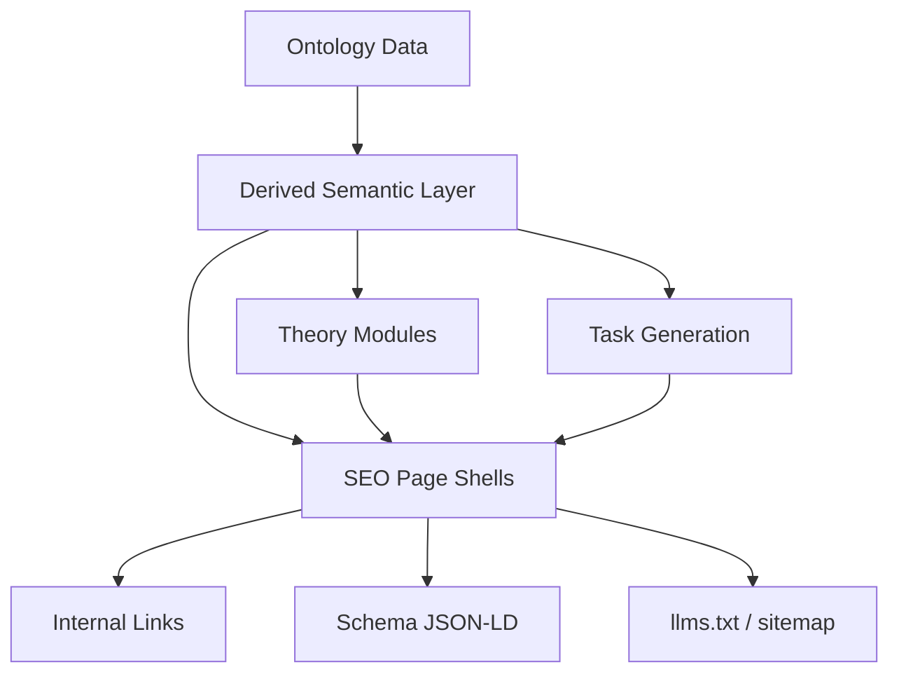
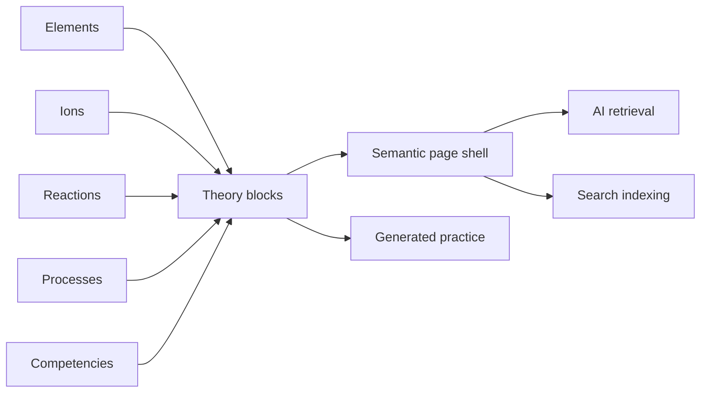

# SEO Architecture: Ontology-Driven Knowledge Graph

> Synthesized from: chemistry_taskgen_seo_ai_architecture.zip + chemistry_seo_ai_package.zip + chemistry_ontology_seo_graph.zip
> Status: **Architecture invariant** — принято без обсуждения

## Core Principles (Architecture Invariants)

**1. Не создавать отдельный контентный мир для SEO.**

Одна онтология обслуживает 4 задачи одновременно:

```
Ontology data
(elements, ions, substances, reactions, processes, competencies)
        ↓
Derived semantic layer
(related entities, concept blocks, examples, evidence, links)
        ↓
Two output channels
A) Learning runtime: theory modules + generated tasks
B) Search/runtime shell: semantic pages + internal linking + schema + llms.txt
```

**2. Derived semantic layer** — это промежуточный слой между raw ontology и внешними представлениями. Именно он позволяет не дублировать логику в theory modules, page shells, related links, representative examples.

**3. Static shell + lazy islands** — indexable HTML на сервере/build-time, interactivity в islands.

**4. Internal links as primary SEO lever** — graph сначала, expansion families потом.

---

## System Flow (Mermaid)



## Entity → Output Flow



---

## Page Indexing Tiers

### Tier A — Core Pages (always indexed, ~150–300 total)

These have stable search intent, full semantic shells, and are the primary entry points.

| URL Pattern | Notes |
|-------------|-------|
| `/` (all locales) | Homepage |
| `/periodic-table/` (all locales) | Section hub |
| `/periodic-table/{element}` (all locales) | Element detail ×118×4 |
| `/bonds/`, `/oxidation-states/`, `/reactions/`, `/calculations/` (all locales) | Core theory |
| `/diagnostics/`, `/exam/`, `/competencies/` (all locales) | Exam prep |
| `/ions/` (all locales) | **Hub only** — not individual ion pages |
| `/substances/` (all locales) | **Hub only** — not individual substance pages |

### Tier B — Expandable Knowledge Pages (index only when shell is strong)

Indexed only if **all 4 conditions** are met:
1. Unique search intent exists
2. Contains ≥4 meaningful semantic content blocks
3. Has ≥3 natural incoming links from the graph
4. Not duplicating another concept page

| URL Pattern | Phase |
|-------------|-------|
| `/ions/{ion}` | Phase 2 — start with 5–10 high-value ions, measure, then expand |
| `/substances/{substance}` | Phase 2 — start with most-linked substances |
| `/reactions/{reaction}` | Phase 2 — requires full template (see `06-page-templates.md`) |
| `/concepts/{concept}` | Phase 2 — start with: oxidation-states, chemical-bond, neutralization, electrolyte, catalyst |
| `/class/{substance_class}` | Phase 3 |

### Tier C — Navigation Pages (UX only, not SEO targets)

These **strengthen internal links** but must never become SEO targets by default.

| URL Pattern | Rule |
|-------------|------|
| `/periodic-table/group/{n}` | `<meta name="robots" content="noindex">` or exclude from sitemap |
| `/periodic-table/period/{n}` | Same |
| Filter combinations | Same |

**This is non-negotiable.** Tier C pages exist for UX and crawl graph, not for mass indexing.

---

## Sitemap Admission Policy

**A URL is included in sitemap only if ALL conditions are met:**

1. Has a canonical URL (no query params, no hash navigation)
2. Is indexable (no noindex meta, not blocked in robots.txt)
3. Contains ≥4 meaningful semantic content blocks in server-rendered HTML
4. Has ≥3 natural incoming internal links from other indexed pages
5. Is NOT a browse/filter/navigation page (Tier C)
6. Has unique search intent not already covered by another page

**Violation examples:**
- `/periodic-table/group/16/` with only a list of elements → Tier C, exclude
- `/substances/NaCl/` with only formula + one paragraph → fails block count, exclude
- Locale duplicate without translated content → exclude

---

## Problem / Solution

**Problem:** Large educational knowledge bases suffer from:
- Discovered but not indexed pages
- Thin or duplicate content signals
- Poor crawl graph
- Weak topical authority signals

**Solution:** Ontology → page network → internal links → topical authority

---

## Entity Flow Examples

### Element: Oxygen

```
Element O
  ↓
Theory blocks: nonmetal, period 2, group 16, oxidation states, role in oxides
  ↓
Page shell: overview, properties, oxidation states, typical reactions, related links
  ↓
Task engine: compare electronegativity, determine oxidation state, classify oxide examples
  ↓
AI/SEO: entity page, linked concept pages, included in llms.txt section map
```

### Concept Page: Oxidation States

```
Rules + examples + competencies
  ↓
Theory module
  ↓
Concept page (Tier B — phase 2)
  ↓
Representative tasks
  ↓
Quiz / practice island
  ↓
Schema: Course / LearningResource / Quiz
```

---

## Roadmap

| Phase | Goal |
|-------|------|
| **1** | llms.txt + robots.txt AI bots + IndexNow + Organization/Dataset/Course schema + RSS |
| **2** | 5–10 ion detail pages + 5 concept pages + strengthen internal link graph |
| **3** | Measure indexing signals → selective expansion of Tier B families |
| **4** | Connect task engine — build-time representative examples for pages |
| **5** | Scale: reaction pages, substance pages if search intent confirmed |
