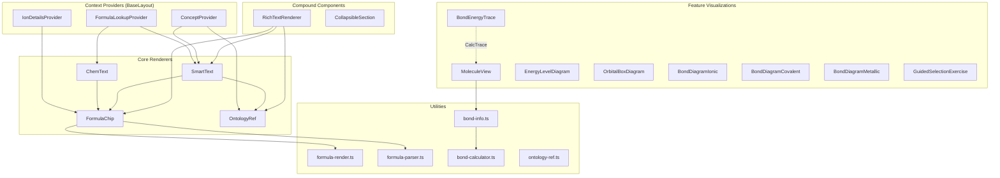
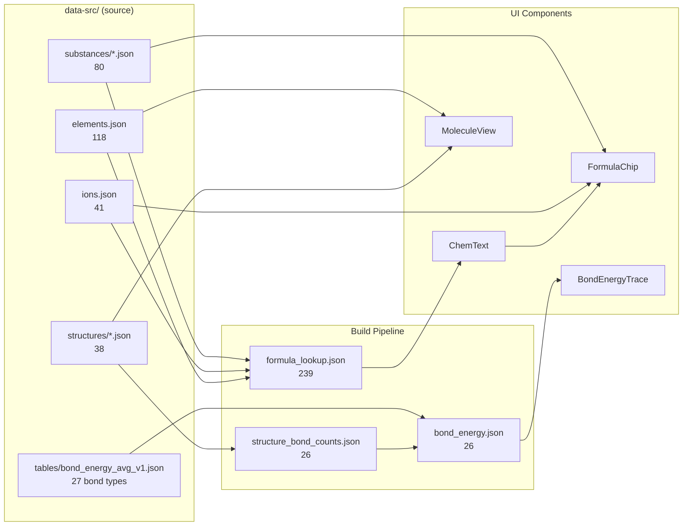

# Визуальные компоненты — Chemistry Without Magic

> Каталог UI-компонентов, отображающих химические данные из онтологии.
> Дополнение к [Ontology Map](./ontology-map.md).
> Обновлено: 2026-03-04

---

## 1. Архитектура визуального слоя



### Поток данных

```
Ontology (JSON) → Data Loaders → Context Providers → Renderers → DOM
                                                    ↗
Astro build-time (readFile) → props → React islands
```

Все компоненты **read-only**: данные онтологии идут из загрузчиков через провайдеры к потребителям. Визуальное состояние (видимость слоёв, свёрнутые секции, тултипы) управляется локально через `useState`.

---

## 2. Context Providers

Обёртки в `BaseLayout.astro`, инжектируют общие данные для всех дочерних компонентов.

### ConceptProvider

| | |
|---|---|
| **Файл** | `src/components/ConceptProvider.tsx` (25 строк) |
| **Экспорт** | `ConceptProvider`, `useConcepts()` |
| **Данные** | `ConceptRegistry` (id → kind, parent_id, filters), `ConceptOverlay` (id → name, slug, forms), `ConceptLookup` (surface → id) |
| **Потребители** | `OntologyRef`, `SmartText` |
| **Онтология** | [→ ontology-map.md §12 ID System](./ontology-map.md#12-id-system-reference) — пространства имён `cls:`, `grp:`, `rxtype:`, `proc:` и др. |

### IonDetailsProvider

| | |
|---|---|
| **Файл** | `src/components/IonDetailsProvider.tsx` (191 строка) |
| **Экспорт** | `IonDetailsProvider`, `useIonDetails()` |
| **Данные** | `loadIons(locale)` → formula, name, type, charge, parent_acid |
| **Рендер** | Popup/модалка с `FormulaChip` для parent_acid; адаптивно (мобильное — fullscreen, десктоп — tooltip) |
| **Потребители** | `FormulaChip` (клик по ionId) |
| **Paraglide** | `ion_details_title`, `ion_type_label`, `ion_charge`, `ion_parent_acid`, `ion_cation`, `ion_anion` |
| **Онтология** | [→ ontology-map.md §1 Ions](./ontology-map.md#1-overview--entity-count-table) — 41 ион |

### FormulaLookupProvider

| | |
|---|---|
| **Файл** | `src/components/ChemText.tsx` (строки 10–28) |
| **Экспорт** | `FormulaLookupProvider`, `useFormulaLookup()` |
| **Данные** | `FormulaLookup` = `Record<string, FormulaLookupEntry>` — type (substance/element/ion), id, cls?, ionType? |
| **Потребители** | `ChemText`, `SmartText`, `RichTextRenderer`, `TheoryModulePanel` (FormulaChip в rule_card блоках) |
| **Монтирование** | 6 страничных React islands: BondsPage, SubstancesPage, ReactionsPage, OxidationStatesPage, PeriodicTablePage, CalculationsPage — загружают `formula_lookup.json` и монтируют провайдер; это исправляет "unknown" FormulaChip в дочерних компонентах |
| **Онтология** | [→ ontology-map.md §16B formula_lookup.json](./ontology-map.md#16b-build-time-derived-files-regenerable) — 239 записей из elements + substances + ions |

---

## 3. Core Renderers

### FormulaChip

| | |
|---|---|
| **Файл** | `src/components/FormulaChip.tsx` (177 строк) |
| **Экспорт** | `FormulaChip` (default) |
| **Props** | `formula`, `name?`, `substanceClass?`, `subclass?`, `substanceId?`, `locale?`, `oxidationStates?`, `ionType?`, `ionId?` |
| **Рендер** | Inline-бейдж `<span class="formula-chip">` с HTML `<sup>/<sub>` для формул |
| **Функции** | Цветной фон по классу/типу иона; тултип (name · class · subclass · ox states); клик: ionId → popup, substanceId → навигация; hover → highlight-event для периодической таблицы |
| **Зависимости** | `parseChemicalFormula()` из `formula-render.ts`, `parseFormula()` из `formula-parser.ts`, `useIonDetails()`, `localizeUrl()` |
| **Цвета** | Cation: #eff6ff/#1e40af (blue), Anion: #fef2f2/#991b1b (red), Oxide/Acid/Base/Salt/Simple: CSS variables |
| **Paraglide** | `class_*_lower`, `subclass_*`, `ion_cation`, `ion_anion` |
| **Онтология** | Отображает: Elements (118), Ions (41), Substances (80), OxidationStates — [→ ontology-map.md §2 Core Entity](./ontology-map.md#2-core-entity-diagram) |

### OntologyRef

| | |
|---|---|
| **Файл** | `src/components/OntologyRef.tsx` (113 строк) |
| **Экспорт** | `OntologyRef` (default) |
| **Props** | `id` (concept ID, e.g. `"cls:oxide"`), `form?` (грамматическая форма), `surface?` (override), `locale?` |
| **Рендер** | `<a>` ссылка с тултипом → URL строится по цепочке parent_id для иерархических slug'ов |
| **CSS** | `ont-ref--{kind}` или `ont-ref--{substance_class}` |
| **Зависимости** | `useConcepts()`, `CONCEPT_KIND_ROUTES` из `i18n.ts`, `localizeUrl()` |
| **Онтология** | Универсальная ссылка на любую сущность онтологии — [→ ontology-map.md §12 ID System](./ontology-map.md#12-id-system-reference) |

**Система префиксов OntRef** (из `src/lib/ontology-ref.ts`):

| Prefix | Kind | Пример |
|--------|------|--------|
| `el:` | element | `el:na` → Натрий |
| `sub:` | substance | `sub:naoh` → NaOH |
| `ion:` | ion | `ion:na_plus` → Na⁺ |
| `rx:` | reaction | `rx:neutralization_1` |
| `cls:` | substance_class | `cls:oxide` → Оксиды |
| `grp:` | element_group | `grp:alkali_metals` |
| `rxtype:` | reaction_type | `rxtype:exchange` |
| `rxfacet:` | reaction_facet | `rxfacet:exothermic` |
| `proc:` | process | `proc:dissolution` |
| `prop:` | property | `prop:electronegativity` |
| `ctx:` | context | `ctx:aqueous` |

### ChemText

| | |
|---|---|
| **Файл** | `src/components/ChemText.tsx` (166 строк) |
| **Экспорт** | `ChemText` (default) |
| **Props** | `text: string` |
| **Рендер** | Автодетекция формул в тексте → оборачивает в `FormulaChip` |
| **Алгоритм** | Regex из FormulaLookup (longest match first), lookbehind-фильтр (пропускает латинские/кириллические контексты), фильтр Roman numerals |
| **Зависимости** | `useFormulaLookup()`, `FormulaChip` |
| **Онтология** | [→ ontology-map.md §16B formula_lookup.json](./ontology-map.md#16b-build-time-derived-files-regenerable) — 239 маппингов |

### SmartText

| | |
|---|---|
| **Файл** | `src/components/SmartText.tsx` (119 строк) |
| **Экспорт** | `SmartText` (default) |
| **Props** | `text: string`, `locale?: SupportedLocale` |
| **Рендер** | Комбинированная автодетекция: формулы (высокий приоритет) + концепты (низкий приоритет) |
| **Алгоритм** | Объединённый lookup: concepts ∪ formulas (formulas override), case-insensitive, longest first |
| **Рендерит** | `FormulaChip` (формулы) или `OntologyRef` (концепты) |
| **Зависимости** | `useFormulaLookup()`, `useConcepts()` |

---

## 4. Compound Components

### TheoryModulePanel

| | |
|---|---|
| **Файл** | `src/components/TheoryModulePanel.tsx` (~260 строк) |
| **Экспорт** | `TheoryModulePanel` (default) |
| **CSS** | `src/components/theory-module.css` — theory-panel__* (trigger/container) + theory-module__* (блоки) |
| **Props** | `moduleKey: string`, `pageKey: string`, `locale?: SupportedLocale`, `forceSectionId?: string` |
| **Данные** | `loadTheoryModule(moduleKey)` → JSON из `data-src/theory_modules/{key}.json` |
| **Рендер** | Кнопка-триггер (открыть/закрыть) → lazy load JSON → `CollapsibleSection` per section → `renderBlock()` per block |
| **Блок-типы** | heading (h2/h3/h4), paragraph, ordered_list, equation, formula_list (FormulaChip), rule_card (FormulaChip для examples), example_block, table, component_slot (SolubilityTable/ActivitySeriesBar), frame |
| **Lazy slots** | `SolubilityTable` (lazy-import), `ActivitySeriesBar` (lazy-import) |
| **Используется** | BondsPage (`bonds_and_crystals`), OxidationStatesPage (`oxidation_states`), CalculationsPage (`calculations`) |
| **Онтология** | [→ ontology-map.md §Theory Modules](./ontology-map.md#theory-modules-data-srctheory_modules) |

### CollapsibleSection

| | |
|---|---|
| **Файл** | `src/components/CollapsibleSection.tsx` (~90 строк) |
| **Экспорт** | `CollapsibleSection` (default), `useTheoryPanelState()` |
| **Props** | `id`, `pageKey`, `title`, `forceOpen?`, `children` |
| **Состояние** | Открыт/закрыт — сохраняется в localStorage (`theory-panel:{pageKey}:{id}`) |
| **Хук** | `useTheoryPanelState(pageKey)` — возвращает `[open, toggleOpen]` для `theory-panel:{pageKey}` ключа |
| **Потребители** | `TheoryModulePanel`, `ClassificationTheoryPanel`, `ReactionTheoryPanel` |

### RichTextRenderer

| | |
|---|---|
| **Файл** | `src/components/RichTextRenderer.tsx` (56 строк) |
| **Экспорт** | `RichTextRenderer` (default) |
| **Props** | `segments: RichText`, `locale?: SupportedLocale` |
| **AST** | `RichText = TextSeg[]` — типизированный массив сегментов |

**Типы сегментов** (из `src/types/ontology-ref.ts`):

| Тип | Описание | Рендерится как |
|-----|----------|---------------|
| `{ t: 'text', v: string }` | Простой текст | `SmartText` (повторная автодетекция) |
| `{ t: 'ref', id, form?, surface? }` | Ссылка на концепт | `OntologyRef` |
| `{ t: 'formula', kind, id?, formula }` | Химическая формула | `FormulaChip` |
| `{ t: 'br' }` | Перенос строки | `<br/>` |
| `{ t: 'em', children: RichText }` | Курсив | `<em>` + рекурсия |
| `{ t: 'strong', children: RichText }` | Жирный | `<strong>` + рекурсия |

**Pipeline**: JSON AST → `RichTextRenderer` → компоненты → DOM

---

## 5. Feature Visualizations

### MoleculeView — 2D визуализатор молекул

| | |
|---|---|
| **Файл** | `src/components/MoleculeView.tsx` (784 строки) |
| **Экспорт** | `MoleculeView` (default) |
| **Props** | `structure: MoleculeStructure`, `layers?: MoleculeLayerVisibility`, `size?`, `interactive?`, `bondInfo?: BondInfoEntry[]` |
| **Данные** | `data-src/structures/*.json` (38 молекул) — [→ ontology-map.md §16A Structures](./ontology-map.md#16a-source-files-manually-edited) |
| **Где** | Страницы веществ (`SubstanceDetailPage.astro`), React island `client:idle` |

**SVG-слои** (переключаемые):

| Слой | Содержимое | Paraglide |
|------|-----------|-----------|
| **Bonds** | Одинарные/двойные/тройные линии, дативные стрелки | `mol_layer_bonds` |
| **Lone Pairs** | Точечные пары, автопозиционирование | `mol_layer_lone_pairs` |
| **Atom Labels** | Символы элементов, hover-тултип (ox state) | — |
| **Oxidation States** | Цветные метки (±0 нейтральный, +/− цветные) | `mol_layer_ox_states` |
| **Polarity** | δ+/δ− аннотации | `mol_layer_charges` |
| **Bond Info** | Тип связи + ΔEN на каждой связи | `mol_layer_bond_info` |

**Алгоритм аннотаций**: строит карту углов связей → находит наибольшие свободные промежутки → размещает ox states, charges, lone pairs без перекрытий.

### BondEnergyTrace — таблица энергий связей

| | |
|---|---|
| **Файл** | `src/features/substances/BondEnergyTrace.tsx` (53 строки) |
| **Экспорт** | `BondEnergyTrace` (default) |
| **Props** | `trace: CalcTrace` |
| **Данные** | `derived/bond_energy.json` (26 веществ) — [→ ontology-map.md §16B derived files](./ontology-map.md#16b-build-time-derived-files-regenerable) |
| **Где** | Страницы веществ, после MoleculeView, React island `client:idle` |

**Рендер**:

| Столбец | Описание | Пример |
|---------|----------|--------|
| Связь | Формат: C—H (одинарная), C═O (двойная), N≡N (тройная) | H—O |
| Кол-во | Число связей данного типа | 2 |
| E, кДж/моль | Средняя энергия связи | 463 |
| Итого | count × E | 926 |
| **Суммарная** | Сумма всех subtotal | **926** |

**Quality badge**: `estimated` (зелёный) — все связи найдены в таблице; `partial` (жёлтый) — часть связей отсутствует.

**Pipeline**: `structures/*.json` → `derive-bond-counts.mjs` → `structure_bond_counts.json` → `calc-bond-energy.mjs` + `bond_energy_avg_v1.json` → `bond_energy.json` → `BondEnergyTrace`

### ReactionCards — карточки реакций с фазовыми маркерами

| | |
|---|---|
| **Файл** | `src/features/reactions/ReactionCards.tsx` |
| **Фазовые маркеры** | ↑ для газообразных продуктов, ↓ для осадков (вкладка Molecular) |
| **Источник данных** | `reaction.observations.gas[]` и `reaction.observations.precipitate[]` |
| **CSS** | `.rxn-phase-marker` — жирный, уменьшенный шрифт, `var(--color-text-secondary)` |
| **Где** | Страница реакций (`/reactions/`), вкладка Molecular |

---

### EnergyLevelDiagram — диаграмма энергетических уровней

| | |
|---|---|
| **Файл** | `src/features/periodic-table/EnergyLevelDiagram.tsx` (110 строк) |
| **Props** | `Z: number` |
| **Рендер** | SVG: горизонтальные линии (орбитали), точки (электроны), валентные — синим |
| **Алгоритм** | `getEnergyLevels(Z)` из `electron-config.ts` |
| **Где** | Страницы элементов (периодическая таблица) |
| **Онтология** | [→ ontology-map.md §14 electron config](./ontology-map.md#14-algorithm-location-map) |

### OrbitalBoxDiagram — диаграмма орбитальных ячеек

| | |
|---|---|
| **Файл** | `src/features/periodic-table/OrbitalBoxDiagram.tsx` (110 строк) |
| **Props** | `Z: number` |
| **Рендер** | SVG: ячейки по подоболочкам (1s, 2s, 2p…), стрелки ↑/↓ (спины), валентные — синим |
| **Алгоритм** | `getOrbitalBoxes(Z)`, `getValenceElectrons(Z)` из `electron-config.ts` |
| **Где** | Страницы элементов |
| **Онтология** | [→ ontology-map.md §14 electron config](./ontology-map.md#14-algorithm-location-map) |

### Bond Diagrams — визуализация типов связей

| Компонент | Файл | Строк | Визуал |
|-----------|------|-------|--------|
| **BondDiagramIonic** | `src/features/bonds/diagrams/BondDiagramIonic.tsx` | 138 | Перенос электрона A → B, ионы |
| **BondDiagramCovalent** | `src/features/bonds/diagrams/BondDiagramCovalent.tsx` | 108 | Общая пара, δ+/δ− (polar) |
| **BondDiagramMetallic** | `src/features/bonds/diagrams/BondDiagramMetallic.tsx` | 113 | Решётка катионов, электронное облако |

**Props**: `symbolA, symbolB` (ionic, covalent) или `symbol` (metallic).
**Где**: Страница связей (`/bonds/`), теория связей.
**Онтология**: [→ ontology-map.md §4 Rule System](./ontology-map.md#4-rule-system-diagram) — bond theory, Δχ classification.

### GuidedSelectionExercise — генетические цепочки

| | |
|---|---|
| **Файл** | `src/features/task-engine/components/GuidedSelectionExercise.tsx` (69 строк) |
| **Props** | `chain: string[]`, `gapIndex: number`, `options: {id, text}[]`, `onSelect(id)` |
| **Рендер** | Ряд элементов цепочки: `A → B → ? → D`, кнопка-gap раскрывает выпадающий список |
| **Где** | Генеративный движок, задачи `guided_selection` |
| **Онтология** | [→ ontology-map.md §6 Task Engine Pipeline](./ontology-map.md#6-task-engine-pipeline-diagram) — interaction type `guided_selection` |

---

## 6. Utility Libraries

| Модуль | Файл | Строк | Экспорт | Назначение |
|--------|------|-------|---------|------------|
| **formula-render** | `src/lib/formula-render.ts` | 128 | `parseChemicalFormula()`, `parseFormulaParts()` | Unicode/ASCII → `{type, content}[]` для `<sup>/<sub>` |
| **formula-parser** | `src/lib/formula-parser.ts` | 55 | `parseFormula(formula)` | Формула → `Record<symbol, count>` (NaCl → {Na:1, Cl:1}) |
| **bond-calculator** | `src/lib/bond-calculator.ts` | 189 | `determineBondType()`, `determineCrystalStructure()`, `analyzeFormula()` | Δχ → ionic/covalent_polar/covalent_nonpolar/metallic |
| **bond-info** | `src/lib/bond-info.ts` | 56 | `computeBondInfo(structure, elementsMap)` | Для MoleculeView: тип связи + ΔEN по каждой связи |
| **calc-bond-energy** | `src/lib/calc-bond-energy.ts` | 78 | `calcBondEnergyV1(entityId, bondCounts, table)` | Сумма средних энергий связей → `BondEnergyResult` с trace |
| **ontology-ref** | `src/lib/ontology-ref.ts` | 61 | `parseOntRef()`, `toOntRefStr()`, `richTextToPlainString()` | Парсинг/сериализация OntRef строк |

---

## 7. Сводная таблица

| Слой | Компонент | Тип | Строк | Онтология (сущности) |
|------|-----------|-----|-------|---------------------|
| **Provider** | ConceptProvider | Context | 25 | Concepts (registry + overlay + lookup) |
| **Provider** | IonDetailsProvider | Modal | 191 | Ions (41) |
| **Provider** | FormulaLookupProvider | Context | 18 | FormulaLookup (239 entries) |
| **Renderer** | FormulaChip | Badge | 177 | Elements, Ions, Substances, OxStates |
| **Renderer** | OntologyRef | Link | 113 | Все сущности (11 видов, prefix-based) |
| **Renderer** | ChemText | Auto-parser | 166 | FormulaLookup → FormulaChip |
| **Renderer** | SmartText | Auto-parser | 119 | FormulaLookup + Concepts → FormulaChip/OntologyRef |
| **Compound** | TheoryModulePanel | Panel | ~260 | theory_modules/*.json → rule_card/table/equation blocks |
| **Compound** | CollapsibleSection | Accordion | ~90 | Persistent open/close state (localStorage) |
| **Compound** | RichTextRenderer | Composite | 56 | RichText AST → SmartText/OntologyRef/FormulaChip |
| **SVG** | MoleculeView | 2D Viz | 784 | Structures (38), Bonds, OxStates, Polarity |
| **SVG** | BondEnergyTrace | Table | 53 | BondEnergyTable (27 типов), CalcTrace (26 веществ) |
| **SVG** | EnergyLevelDiagram | Diagram | 110 | Elements (Z → electron config) |
| **SVG** | OrbitalBoxDiagram | Diagram | 110 | Elements (Z → orbital boxes) |
| **SVG** | BondDiagramIonic | Diagram | 138 | Bond theory (Δχ → ionic) |
| **SVG** | BondDiagramCovalent | Diagram | 108 | Bond theory (Δχ → covalent) |
| **SVG** | BondDiagramMetallic | Diagram | 113 | Bond theory (metallic) |
| **SVG** | GuidedSelectionExercise | Exercise | 69 | Genetic chains (5) |
| **Utility** | formula-render.ts | Parser | 128 | — (чистый парсинг) |
| **Utility** | formula-parser.ts | Parser | 55 | — (чистый парсинг) |
| **Utility** | bond-calculator.ts | Logic | 189 | Elements (electronegativity, metal_type) |
| **Utility** | bond-info.ts | Compute | 56 | Structures + Elements → BondInfoEntry[] |
| **Utility** | calc-bond-energy.ts | Compute | 78 | BondCounts + BondEnergyTable → CalcTrace |
| **Utility** | ontology-ref.ts | Logic | 61 | — (парсинг ID) |

---

## 8. Иерархия провайдеров

```
BaseLayout.astro
├─ FormulaLookupProvider  ← loadFormulaLookup()  [ConceptModuleIsland]
│  ├─ ConceptProvider     ← loadConceptRegistry() + loadConceptOverlay()
│  │  ├─ IonDetailsProvider  ← loadIons(locale)
│  │  │  └─ ... страницы
│  │  │     ├─ ChemText          → useFormulaLookup()
│  │  │     ├─ SmartText         → useFormulaLookup() + useConcepts()
│  │  │     ├─ FormulaChip       → useIonDetails()
│  │  │     ├─ OntologyRef       → useConcepts()
│  │  │     ├─ RichTextRenderer  → SmartText + OntologyRef + FormulaChip
│  │  │     ├─ MoleculeView      (props only, no context)
│  │  │     └─ BondEnergyTrace   (props only, no context)

Страничные React islands (BondsPage, SubstancesPage, ReactionsPage,
OxidationStatesPage, PeriodicTablePage, CalculationsPage):
├─ FormulaLookupProvider  ← loadFormulaLookup()  [page-level, fixes "unknown" FormulaChip]
│  ├─ TheoryModulePanel   → useFormulaLookup() (для FormulaChip в rule_card блоках)
│  ├─ ClassificationTheoryPanel  → FormulaChip (substanceClass/substanceId из substances index)
│  ├─ ReactionTheoryPanel
│  └─ ...
```

---

## 9. Связь с данными онтологии



---

## Ссылки

- [Ontology Map](./ontology-map.md) — полная карта данных, алгоритмов, pipeline
- [CLAUDE.md](../CLAUDE.md) — coding conventions, data vs code boundary
- [Technical Spec](./02_technical_spec.md) — архитектурные решения
